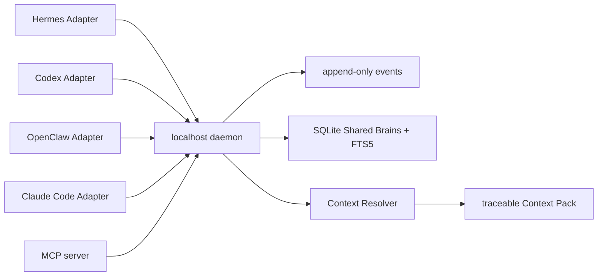

# Shared Brain 架構

Memlume Core 是 MIT 授權的本機共享記憶核心。Hermes、Codex CLI、OpenClaw、Claude Code 與 MCP Client 都透過各自 Adapter 呼叫同一個 loopback daemon；Adapter 只翻譯 Host lifecycle 差異，不持有另一份記憶資料。

## 讀取與寫入邊界

- 任務開始、選工具前：Adapter 呼叫 `POST /v1/context/resolve`，只得到已掛載 Brain、scope、有效日期與 budget 允許的記憶。
- 特定細節缺失時：使用 `memlume.search`，不把完整資料庫放入 prompt。
- 使用者明確說「記住」時：Adapter 呼叫 `POST /v1/memories/capture`。Core 會保存原始 event、去除秘密，並依明確性建立 active 或 candidate；重送以 source reference 去重。
- 直接結構化寫入（`POST /v1/memories`）對 Hermes、Codex、OpenClaw、Claude Code installation 預設只建立 candidate；只有 CLI 以 setup token 產生的短時效、單次 HMAC 使用者確認簽章，才可把明確命令寫成 active。簽章消費狀態持久化在 SQLite，daemon 重啟後也不能重放。
- 任務結果可判斷時：先使用該次 `resolve_context` 回傳的 `traceId`，再以 `memlume.record_memory_usage` 與 `memlume.record_outcome` 回報採用、忽略或修正。收據約 15 分鐘有效、每個 installation 有短時間簽發上限，且只能回報該次 Context Pack 實際包含的 `sourceMemoryIds`；每個 trace 只允許一次 task outcome，跨 receipt 對同一記憶每 24 小時只計一次 feedback。這些 append-only 訊號只影響未來排序，不改寫既有 memory/history。

Agent 的 native memory 不會被讀取、覆寫或同步。沒有 mount 的 installation 直接呼叫 context、search 或 candidate endpoint 會取得 `403 forbidden`，不能讀取或寫入其他 Brain；Adapter SDK 會把這種拒絕與 daemon 暫停一樣轉為空 Context Pack，讓 Agent 原生能力仍可繼續。

## 權限與資料

Setup token 只用於註冊、Brain、mount、備份、診斷與受保護的 candidate review；Adapter bearer token 只代表單一 installation。每一個寫入與回饋都會再次檢查 `read_write` mount，回饋還必須具備由同一 installation 解析出的短期 receipt，回應不會包含 token。SQLite、FTS5、備份與 restore 都由 Core 處理；網站只需提供下載、安裝器、更新與文件入口即可，所有功能均維持 MIT 開源 Core。

## 可觀察性

Context Pack 的 `traceId`、`sourceMemoryIds`、排除原因與 budget 單位，讓每次注入都能回溯。Outcome feedback 採固定分數：adopted `+2`、ignored `-1`、corrected `-2`；task success `+1`、failure `-1`、corrected `-2`。沒有向量模型或不可解釋的自動學習。
