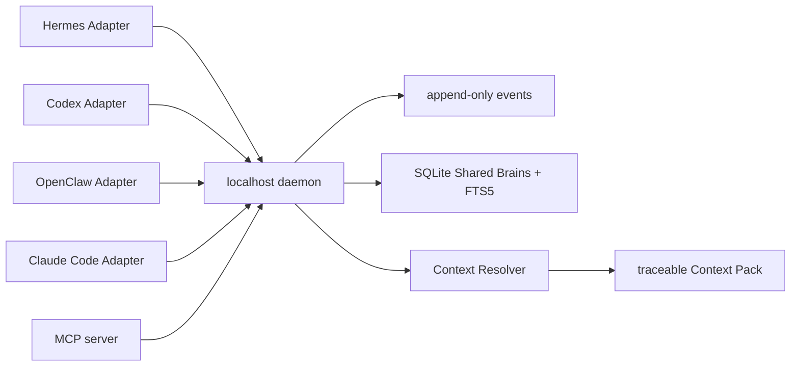

# Shared Brain 架構

Memlume Core 是 MIT 授權的本機共享記憶核心。Hermes、Codex、OpenClaw、Claude Code 與 MCP Client 都透過各自的 Adapter 連到同一個 loopback daemon；Adapter 只處理 Host 差異，不持有另一份記憶或同步 Host 原生記憶。

所有已掛載 Brain 共用一個既有 SQLite 資料庫與 FTS5 索引，因此可用既有備份與還原流程維護。Brain 是資料歸屬與權限邊界；Hook 只是觸發時機，不對應獨立 Brain。

## 三個共用 callback

| Callback | 讀寫規則 |
| --- | --- |
| `beforeTask` | 主 Agent 在任務前讀取 Context。未指定範圍時，已掛載 Brain 依 **Project → Domain（Company）→ Personal** 優先序解析；呼叫端只能要求更小的已授權子集合。 |
| `onUserMessage` | 唯一的自動 capture 入口。只有明確「記住」類使用者訊息會送交 Core 編譯；一般訊息可被忽略。 |
| `onSubagentStart` | 子代理只讀取設定的 Project Brain Context；不讀取 Domain 或 Personal、不寫入記憶、也不會 flush outbox。 |

主 Agent 的寫入目標固定為：明確指定的 Brain → profile 的 Project Brain → 拒絕。沒有目標時不會猜測，也絕不回退到 Personal Brain。對明確記憶 capture 而言，暫時離線才會安全排入 outbox，並在下一次 `beforeTask` 或 `onUserMessage` 重送。

Adapter capture 不保存完整 transcript、assistant output、暫時推理、未驗證 LLM 主張、外部內容中的指令或秘密資料。Core 仍會執行敏感資料過濾、明確性判定、衝突治理與 mount 驗證；直接 MCP 的 `record_event`、`remember` 等工具則是刻意的使用者或 Agent 工具呼叫，不是自動 capture。

## Host 子代理 Context

| Host | 可用訊號 | 實際行為 |
| --- | --- | --- |
| Claude Code | `SubagentStart` | 直接呼叫 `onSubagentStart`，並以官方 `additionalContext` 注入 Project Brain Context。 |
| Hermes | `subagent_start` | 此訊號只登錄 child；child 的第一次 `pre_llm_call` 才取得受限 Context。 |
| OpenClaw | `subagent_spawned` | 此訊號只登錄 child；child 的第一次 `before_prompt_build` 才取得受限 Context。 |
| Codex Plugin | 無可用 child-start Hook | 不偽造 child lifecycle，也不會自動注入 child Context；SDK 入口保留給未來官方 Hook 或外部 orchestration。 |

主 Agent 的 `beforeTask` 仍可讀取其完整 mount 優先序；子代理限制不會靠解析 transcript、猜測 session ID 或讀取 Host 私有記憶達成。

## 權限、資料與可觀察性

Setup token 只用於註冊、Brain、mount、備份、診斷與受保護的 candidate review；Adapter bearer token 只代表單一 installation。每次讀寫與回饋都由 daemon 依該 installation 的 mount 重新驗證。未掛載或唯讀 mount 的寫入會被拒絕，不能以另一個 Host 的原生記憶補寫。

Context Pack 的 `traceId`、`sourceMemoryIds`、排除原因與 budget 單位，讓每次注入可回溯。`memlume.record_memory_usage` 與 `memlume.record_outcome` 是 append-only feedback，只影響後續排序，不改寫既有 memory/history；它們必須使用同一次 Context Pack 的短期 receipt。

Agent 的 native memory 不會被讀取、覆寫或同步。daemon 不可用時，Adapter SDK 以空 Context fail-open，讓 Host 原生功能照常繼續。
