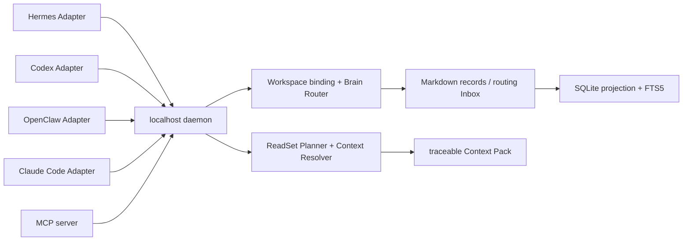

# Shared Brain 架構

Memlume Core 是 MIT 授權的本機共享記憶控制平面。Hermes、Codex、OpenClaw、Claude Code 與 MCP Client 透過各自的 Adapter 連到同一個 loopback daemon；Adapter 只處理 Host 生命週期差異，Brain 路由、寫入治理與 Context 讀取都由 Core 統一處理。

v0.3 的 Brain 選擇由 daemon 依 workspace binding 決定。Host 不再傳入或信任靜態 Brain UUID；每個 workspace 可有一個 Primary Project、零個以上 Linked Project，以及一個 Personal Brain。Markdown records 是語意 authority，SQLite/FTS5 是可重建投影與查詢索引。

## 三個共用 callback

| Callback | v0.3 行為 |
| --- | --- |
| `beforeTask` | 任務前由 daemon 依 workspace、intent、task 與子代理限制產生最小 ReadSet，再注入 active Context。Host 不可自行擴大 Brain 範圍。 |
| `onUserMessage` | 使用者訊息的自動 capture 入口。Core 先做 Secret filter、admission、atomization、Brain Router 與 activation，再寫入 Markdown authority。 |
| `onSubagentStart` | 子代理啟用時讀取受限 ReadSet；沒有 child goal 時只能取得 Primary Project，不能讀取未匹配 Linked 或 Personal，也不自動寫入。 |

## 自動寫入與路由

訊息不會直接變成一筆完整 transcript。Core 會將多主題訊息拆成獨立 atom，依語意 scope 路由到 Personal 或已綁定 Project：

1. Secret filter 在 provider、Markdown、SQLite、outbox 之前執行。
2. 明確偏好、事實、決策與事件進 admission；閒聊、問候與暫時推理可為 `ignored`。
3. 每個 atom 由 daemon-owned Brain Router 解析；未知或模糊 Project 不建立新 Brain，也不回退 Personal，而是寫入頂層 durable routing Inbox。
4. 只有使用者明確授權且沒有衝突的 atom 才能是 `active`；推測內容是 `candidate`，時間軸只作 `event_only`。
5. 先 append immutable Markdown record，再投影 SQLite。SQLite 遺失時可由 Markdown records 與 Inbox reindex。

狀態 `active`、`candidate`、`event_only`、`routing_required`、`ignored`、`rejected` 與 `failed` 都會出現在 receipt/status 中；不要把 `queued` 說成已保存。

## ReadSet 與短回覆授權

`beforeTask` 的 ReadSet 通常包含 Primary Project、與任務或 entity 命中的 Linked Project，以及在需要時的 Personal。ReadSet 的順序與排除原因會寫入 Context Pack explanation；未匹配的 Brain 不會因為掛載存在就注入。

Assistant final 不會自動成為 active memory。Core 只在本機 `.runtime` 保留安裝、session、turn、trace、final answer 的短期資料（最多 64 KiB、24 小時），不進 Brain、FTS、Inbox、capture outbox 或 backup。下一個使用者回覆「可以／同意」時，若仍有有效 final buffer，Core 會重新 atomize、路由並依使用者授權寫入；「修正」會走同一條 conflict/supersedes 流程。沒有 buffer、已過期或只有 assistant 推測時，短回覆會被忽略。

## 子代理 Context

| Host | 觸發訊號 | 行為 |
| --- | --- | --- |
| Claude Code | `SubagentStart` | 呼叫 `onSubagentStart`，透過官方 `additionalContext` 注入受限 ReadSet。 |
| Hermes | `subagent_start` 後首次 `pre_llm_call` | observer 只登錄 child，首次 prompt 才讀取受限 ReadSet。 |
| OpenClaw | `subagent_spawned` 後首次 `before_prompt_build` | observer 只登錄 child，首次 prompt 才讀取受限 ReadSet。 |
| Codex | `SubagentStart` | 呼叫 `onSubagentStart`，注入 Primary-only 或經 child goal 縮小後的 ReadSet。 |

Hook 只決定時機，不對應獨立 Brain，也不會讀取 Host 私有長期記憶。

## 權限、失敗與可觀察性

Setup token 用於註冊、binding、備份、診斷與 review；Adapter bearer token 代表單一 installation。每次讀寫都由 daemon 依 installation 的 mount/access 重新驗證。唯讀 Linked Project 可讀不可寫，未授權寫入會被拒絕。

讀取失敗 fail-open，Host 會收到空 Context 並繼續任務；寫入失敗只把安全且明確的 capture 放入 installation-specific outbox，沒有 silent eviction，queue full、routing_required、rejected 與 degraded 狀態可由 `memlume status`／`memlume doctor` 查到。

`beforeTask` 的本機 outbox flush 有 500ms 上限，daemon Context 讀取有 250ms 上限；OpenClaw 與 Hermes Adapter 的 Host hook 預留至少 1 秒，忙碌檔案系統不會讓 Host 提前取消共享 Context。超時仍採 fail-open，不阻塞原生 Agent 流程。

Context Pack 的 `traceId`、`sourceMemoryIds`、ReadSet exclusion 與 budget 可稽核。Outcome 只關閉 receipt 與留下稽核，不改變 memory status、權重或檢索排序。Agent native memory 不會被讀取、覆寫或同步。
