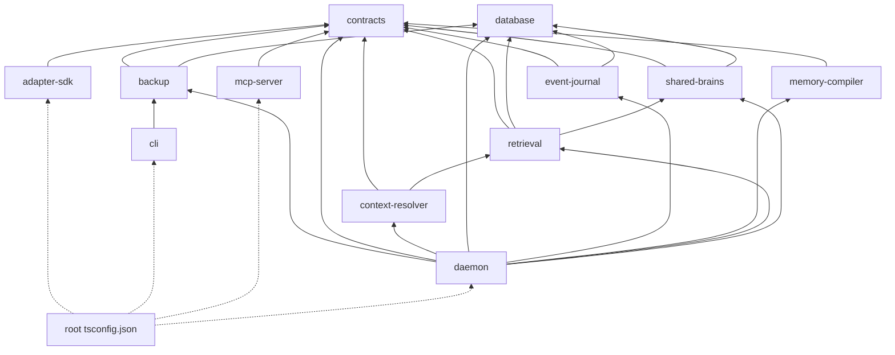

# Memlume TypeScript Project References 設計

**目標：** 讓 `pnpm typecheck` 在乾淨 checkout 上自行建立 workspace declarations、依正確順序檢查所有 Node TypeScript 專案，不再依賴先執行 `test` 或 `build`。

## 問題與根因

`@memlume/cli` 直接依賴 `@memlume/backup`，而 `@memlume/backup` 的型別入口是 `dist/index.d.ts`。現行 root `typecheck` 透過 pnpm 遞迴執行各 package 的 `tsc --noEmit`，但 CLI 沒有先建立 backup 的 declaration，因此乾淨 workspace 會出現 `TS2307`。

這不是 CLI 的單點問題。多個 package 已用 `build:dependencies` 或 `pnpm --filter ... build` 手動維持順序；只修 CLI 會留下同一類錯誤。真正需要修正的是 TypeScript 專案依賴圖與驗證命令的責任歸屬。

## 決策

採用 TypeScript 7 的 Project References 與 build mode：

- `pnpm typecheck` 定義為「完整型別驗證＋必要的增量編譯」，允許產生 `dist` 與 `.tsbuildinfo`。
- root solution `tsconfig.json` 提供唯一入口，`tsc -b` 自動排序並建立過期的 referenced projects。
- 每個 Node TypeScript 專案只宣告直接依賴，避免 root 重複維護完整排序。
- CI 使用 `--stopBuildOnErrors`，上游有錯時停止建立下游產物。
- 不新增 task runner、dependency-graph generator 或 source `paths` 映射。

TypeScript `7.0.2` 是本設計確認時的 npm 最新穩定版，也是官方以 Go 重寫的原生版本。專案目前的 `package.json`、`pnpm-lock.yaml` 與本機 `tsc` 已經使用 `7.0.2`，不需要安裝舊的 `@typescript/native-preview`。官方資料：

- [Announcing TypeScript 7.0](https://devblogs.microsoft.com/typescript/announcing-typescript-7-0/)
- [TypeScript Project References](https://www.typescriptlang.org/docs/handbook/project-references)

## 專案依賴圖

箭頭表示「consumer 依賴 dependency」。root solution 只需列出沒有其他 Node consumer 的四個 leaf projects，其餘由 references 遞迴涵蓋。



## TypeScript 設定

每個 Node TypeScript project 保留既有 `rootDir: "src"`、`outDir: "dist"` 與 `include: ["src"]`，新增：

```json
{
  "compilerOptions": {
    "composite": true,
    "tsBuildInfoFile": "dist/tsconfig.tsbuildinfo"
  },
  "references": [
    { "path": "../direct-dependency" }
  ]
}
```

`tsBuildInfoFile` 明確放入 `dist`，讓既有 `dist/` ignore 規則與 `tsc -b --clean` 一起管理所有產物。`declaration: true` 已存在，維持 package exports 對 `dist/*.d.ts` 的真實邊界。

root solution 使用 `files: []`，只放四個 leaf references，不直接編譯來源，避免重複 compilation。

## Script 行為

- root `typecheck`：`tsc -b --stopBuildOnErrors`。
- 各 Node package `typecheck`：同樣使用 `tsc -b --stopBuildOnErrors`，讓 filtered command 也能自行建立直接與遞迴依賴。
- 各 Node package `build`：改用 `tsc -b`，移除手寫 `build:dependencies`。
- 需要先編譯的 package tests 改成 `pnpm run build && ...`，不再自行列舉依賴。
- daemon 保留 `build:console`，因為它在 runtime 提供 Console 靜態檔；只以 `tsc -b` 取代 daemon 的 Node dependency build。

`typecheck` 與 TypeScript build 的差別只剩用途與命令名稱；兩者都會產生 JavaScript、declarations 與增量狀態。這是 Project References 正確解析 package declaration 的必要代價，也是本次已核准的命令語意。

## Vue Console 邊界

`apps/console` 目前沒有 `typecheck` script，也不參與 Node package declaration graph，因此本次不把它改成 composite project。它仍由 Vite build 驗證。

TypeScript 7.0 尚未提供穩定 compiler API，官方亦提醒 Vue 等 embedded-language 工具可能仍需 TypeScript 6。等專案明確導入 `vue-tsc` 或其他 compiler-API 工具時，再單獨驗證 TypeScript 6 compatibility alias；本次不預先新增第二套 TypeScript。

## CI 與 Release 驗證順序

`ci.yml` 與 `release.yml` 在 `pnpm install --frozen-lockfile` 後、任何 test/build 前執行：

1. 檢查 `apps/*/dist`、`packages/*/dist` 不存在。
2. 執行 `pnpm typecheck`。
3. 確認 CLI 與 backup 的預期產物已建立。
4. 再執行既有 test、E2E、build 與 benchmark。

這會直接證明 typecheck 不依賴先前產物；後續測試即使重用 typecheck 產生的 dist，也不再掩蓋 clean-workspace regression。

## 錯誤處理與回復

- 上游型別錯誤：`--stopBuildOnErrors` 立即以非零狀態結束，不建立下游的誤導性輸出。
- 過期或損壞的 incremental state：執行 `pnpm exec tsc -b --clean` 後重跑 `pnpm typecheck`。
- references 漏列：乾淨 CI 會再次出現 declaration resolution error；修正 consumer 的 direct reference，不加入 root 手寫排序。
- 若 TypeScript 7 project-reference 行為出現 upstream regression，可暫時將 CLI compiler alias 固定至已驗證版本；不退回 package-by-package 手寫 dependency builds。

## 不在本次範圍

- 不將 tests 納入新的 composite test projects；現行 typecheck 本來只涵蓋 `src`。
- 不新增 `paths` 指向 workspace source。
- 不導入 Nx、Turborepo、Wireit 或自製依賴圖驗證器。
- 不調整 package exports、runtime 模組格式或 Console 的 Vue toolchain。
